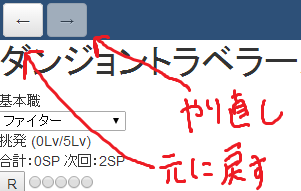
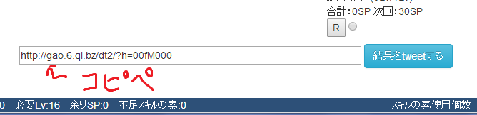
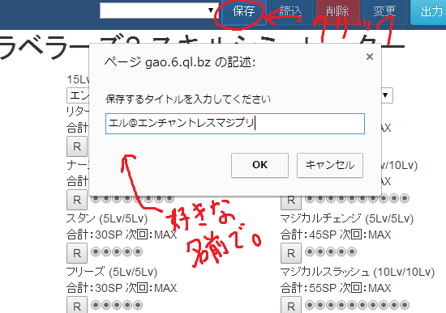
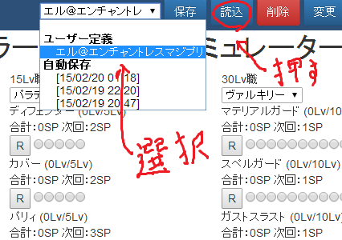
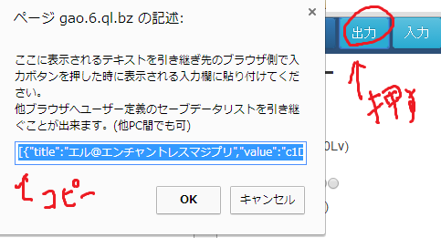
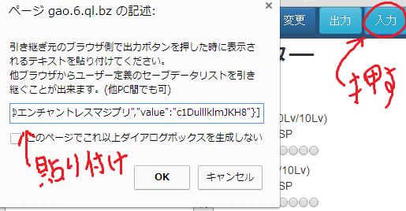

# dt2_skill_simulator
 「[http://gao.6.ql.bz/dt2/](http://gao.6.ql.bz/dt2/)」に公開しているダンジョントラベラーズ2専用のスキルシミュレーターです。

## 使い方
 1. [http://gao.6.ql.bz/dt2/](http://gao.6.ql.bz/dt2/)にアクセスする
 1. シミュレートしたい職を選択する
 1. スキルを振っていく
 1. 下に総SPや必要なLvが記載されるので参考にする
 1. PSPもしくはVitaでダンジョントラベラーズ2を楽しむ

## 高度な使い方
 
### 選択してる職業を変えたらスキル振りが消し飛んじゃった！！戻したい！！  
 - 大丈夫です。元に戻す、やり直す事ができるボタンが左上にありますので元に戻しましょう
   

### 振ったデータを人に教えたいんだけどどうすればいいの？
 - ページの下部にURLを表示していますので、そのURLをコピペして教えてあげてください  
 - Twitterを利用する場合には、TwitterにURLを呟くボタンも設置しています  
 

### 振ったデータをブラウザに保存しておきたいんだけどどうすればいいの？
 - スキルを振った状態で、右上の保存ボタンをおすことで、スキル振りをブラウザに保存することが出来ます  
 
 - 保存したスキル振りを復元したい場合には、プルダウンから復元したいデータを選択して、右上にある読込ボタンを押すことで復元できます  
 
 - ブラウザを閉じた瞬間に自動保存が働いて結果は保存されていますので、不慮の事故の時にはこちらも利用してください(Windows UpdateとかWindows Updateとか)  

### 他のPCに保存しておいたスキル振りデータをまるごと移したい！
 1. 移行**元**のPCで右上の**出力**ボタンを押して、表示されるテキストをコピーします  
 
 1. 移行**先**のPCで右上の**入力**ボタンを押して、先ほどコピーしたテキストを貼り付けます  
 
 1. 移行先のPCにデータを移すことが出来ました  

## ライセンス
 Public Domainです。ご自由にどうぞ。
